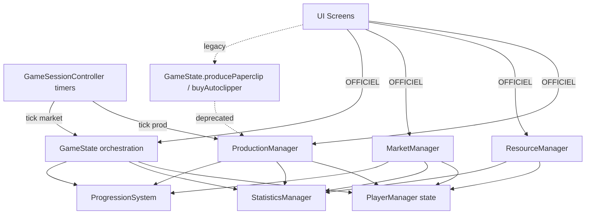
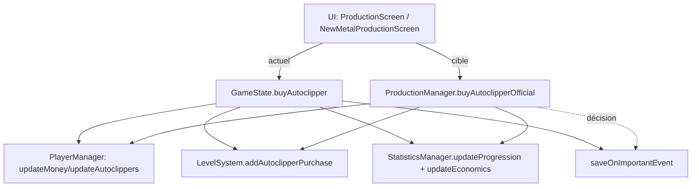
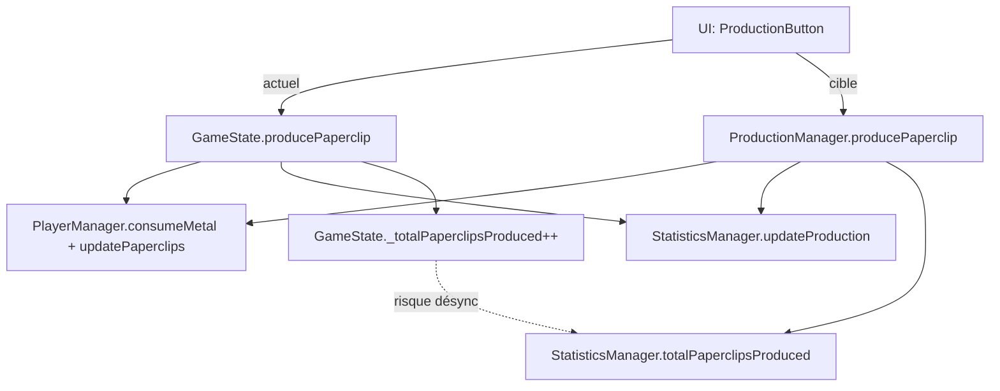

# Plan de refactorisation PaperClip2

Ce document suit l'avancement des phases de refactor définies après l'audit.

## Phase 1 — Persistance (GameSnapshot + GamePersistenceService)

### Étape P1-PR1 — GameSnapshot + GamePersistenceService (brouillon)
- Objectif : Introduire le DTO `GameSnapshot` et l'interface `GamePersistenceService` de manière non invasive.
- Branche suggérée : `refactor/p1-snapshot-and-persistence-interface`
- Fichiers ajoutés :
  - `lib/services/persistence/game_snapshot.dart`
  - `lib/services/persistence/game_persistence_service.dart`
  - `lib/services/persistence/local_game_persistence.dart`
- Tests ajoutés :
  - `test/persistence/snapshot_schema_test.dart`
- Risques :
  - Aucun changement attendu sur le comportement de sauvegarde existant (non branché à GameState pour l'instant).
- Statut : complété.

### Étape P1-PR2 — GameState.toSnapshot / applySnapshot
- Objectif : Permettre à `GameState` de sérialiser/désérialiser son état pur sans modifier le pipeline de sauvegarde actuel.
- Branche suggérée : `refactor/p1-gamestate-snapshot`
- Fichiers modifiés :
  - `lib/models/game_state.dart`
- Tests ajoutés :
  - `test/models/game_state_snapshot_test.dart`
- Risques :
  - Nécessite que l'initialisation des bindings Flutter soit correcte en test (`TestWidgetsFlutterBinding.ensureInitialized`).
- Statut : complété.

### Étape P1-PR3 — LocalGamePersistenceService (adapter vers SaveManagerAdapter)
- Objectif : Implémenter `LocalGamePersistenceService` en s'appuyant sur `SaveManagerAdapter` / `SaveGame` pour sauvegarder et recharger un `GameSnapshot` dans `gameData['gameSnapshot']`.
- Branche suggérée : `refactor/p1-persistence-adapter`
- Fichiers modifiés/ajoutés :
  - `lib/services/persistence/local_game_persistence.dart`
  - `test/persistence/local_persistence_test.dart`
- Changements techniques :
  - `saveSnapshot` crée ou met à jour une sauvegarde nommée `slotId` en injectant le JSON du snapshot dans `SaveGame.gameData`.
  - `loadSnapshot` lit la sauvegarde via `SaveManagerAdapter.loadGame` et reconstruit un `GameSnapshot` à partir de `gameData['gameSnapshot']`.
  - `migrateSnapshot` retourne pour l'instant le snapshot tel quel (la vraie migration sera implémentée dans une phase ultérieure).
- Tests ajoutés :
  - `test/persistence/local_persistence_test.dart` (roundtrip `saveSnapshot` → `loadSnapshot`).
- Risques :
  - Comportement des sauvegardes inchangé tant que `LocalGamePersistenceService` n'est pas branché dans le flux principal.
- Statut : complété.

## Phase 2 — Dégraisser GameState (core + session)

### Mission 1 — Extraction complète de la logique UI / runtime Flutter hors de GameState (ChangeNotifier conservé)

- Objectif : Rendre `GameState` indépendant de l'UI et du runtime Flutter applicatif (BuildContext, widgets, navigation, Provider musique, SystemChannels.lifecycle).
- Décision d’architecture (non négociable) : `GameState` reste un `ChangeNotifier` (dépendance à `flutter/foundation` assumée).

- Fichiers ajoutés :
  - `lib/services/ui/game_ui_port.dart` (port UI sans Flutter)
  - `lib/services/audio/game_audio_port.dart` (port audio sans Flutter)
  - `lib/services/ui/flutter_game_ui_facade.dart` (implémentation Flutter du port UI)
  - `lib/services/audio/flutter_game_audio_facade.dart` (implémentation Flutter du port audio)
  - `lib/services/lifecycle/app_lifecycle_handler.dart` (lifecycle Flutter hors GameState)

- Fichiers modifiés :
  - `lib/models/game_state.dart`
  - `lib/main.dart`
  - `lib/screens/main_screen.dart`

- Logique déplacée hors de `GameState` :
  - Navigation compétitive (`handleCompetitiveGameEnd`) : déléguée à `GameUiPort.showCompetitiveResult`.
  - Snackbars/notifications UI (prix excessif, unlock, leaderboard indisponible) : déléguées à `GameUiPort`.
  - Provider musique (chargement d'état musique par partie) : délégué à `GameAudioPort`.
  - Lifecycle (`SystemChannels.lifecycle`) : déplacé dans `AppLifecycleHandler`.
  - Initialisation du contexte global de notifications : `MainScreen` utilise `NotificationManager.instance.setContext(context)` (et non plus `gameState.setContext`).

- Nettoyage effectué :
  - Suppression de toute importation `material`, `provider`, `services`, écrans/dialogs depuis `GameState`.
  - Suppression de toute référence à `BuildContext`, `Navigator`, `ScaffoldMessenger`, `SnackBar`, `Icons`, `SystemChannels`, `Provider` dans `GameState`.

- Risques / points d'attention :
  - `EventManager` (modèle) dépend encore de `material.dart` : `GameState` ne doit pas y faire référence.
  - Les facades (`FlutterGameUiFacade`, `FlutterGameAudioFacade`, `AppLifecycleHandler`) doivent être initialisées tôt (dans `main.dart`) pour éviter les notifications manquées.
  - Les écrans/widgets qui appelaient des méthodes UI directes sur `GameState` doivent désormais passer par les facades/services UI.

### Mission 2 — Clarification et assainissement de la persistance (pipeline unifié)

- Objectif : Unifier le pipeline load/save et retirer l'orchestration de persistance avancée de `GameState`.

- Rôles cibles (Mission 2) :
  - **GamePersistenceOrchestrator** : orchestrateur unique du **load** et du **save** (y compris stop/restart autosave autour du load).
  - **GameState** : consommateur/appliqueur de données chargées (JSON/snapshot) + sérialisation (`prepareGameData`, `toSnapshot`, `applySnapshot`).
  - **AutoSaveService** : déclencheur périodique/backup qui appelle le pipeline unifié (ne parle plus directement à `SaveManagerAdapter.saveGame`).

- Fichiers modifiés :
  - `lib/models/game_state.dart`
  - `lib/services/persistence/game_persistence_orchestrator.dart`
  - `lib/services/auto_save_service.dart`
  - `lib/screens/start_screen.dart`
  - `lib/screens/save_load_screen.dart`

- Pipeline load (nouveau) :
  1) UI appelle `gameState.loadGame(name)`
  2) `GameState.loadGame` délègue à `GamePersistenceOrchestrator.loadGame(state, name)`
  3) Orchestrator :
     - `state.autoSaveService.stop()`
     - `SaveManagerAdapter.loadGame` + `extractGameData`
     - `state.applyLoadedGameDataWithoutSnapshot(name, gameData)` (application métier)
     - `_applySnapshotIfPresent` → `state.applySnapshot(...)` si présent
     - `await state.finishLoadGameAfterSnapshot(name, gameData)` (post-load métier)
     - `state.autoSaveService.restart()`
  4) UI démarre explicitement `gameState.autoSaveService.start()` après un chargement réussi (StartScreen/SaveLoadScreen).

- Pipeline save (nouveau) :
  - Save manuel/événementiel : `GameState.saveGame` / `saveOnImportantEvent` délèguent à `GamePersistenceOrchestrator`.
  - Autosave/backup : `AutoSaveService` appelle `GamePersistenceOrchestrator.saveGame(...)`.

- Nettoyage effectué :
  - `GameState` ne stop/restart plus l'autosave pendant le load.
  - `GameState` ne fait plus de save initial ni de démarrage autosave dans `startNewGame`.

- Risques / points d'attention :
  - Il existe des validations et du formatage dans `AutoSaveService` (ex: `SaveValidator`) qui ne sont pas encore totalement mutualisés avec `GamePersistenceOrchestrator`.
  - Les appels UI doivent démarrer l'autosave explicitement après load/new game.

### Mission 3 — Unification des règles économie / ressources (achat métal)

- Objectif : garantir une seule source de vérité pour les règles d'achat de métal (argent, capacité, stock marché, coût total).

- Décision (Option A validée) : le stock métal du marché est un invariant gameplay :
  - l'achat échoue si `marketMetalStock < METAL_PACK_AMOUNT`
  - l'achat consomme le stock du marché

- Source de vérité : `ResourceManager`
  - Nouvelle API : `ResourceManager.canPurchaseMetal([customPrice])`
  - `ResourceManager.purchaseMetal` appelle `canPurchaseMetal` et décrémente `marketMetalStock`.

- Fichiers modifiés :
  - `lib/managers/resource_manager.dart`
  - `lib/models/game_state.dart`
  - `lib/screens/production_screen.dart`

- Nettoyage effectué :
  - Suppression de la logique `_canBuyMetal` dans `GameState`.
  - `GameState.canBuyMetal()` délègue désormais à `ResourceManager.canPurchaseMetal()`.
  - L'UI n'interroge plus `GameState.canBuyMetal()` : `ProductionScreen` utilise `resourceManager.canPurchaseMetal()`.

- Risques / points d'attention :
  - Vérifier que `MarketManager.marketMetalStock` est cohérent avec le gameplay (la consommation du stock peut impacter l'économie et les écrans).
  - Éviter les chemins legacy (`purchaseSpecificMetalAmount`) qui manipulent le stock différemment.

### Mission 4 — Extraction des règles de progression et design gameplay

- Objectif : sortir toute règle de design progression enfouie dans `GameState` (milestones, boosts, gating, side-effects d'unlock).

- Fichier ajouté :
  - `lib/services/progression/progression_rules_service.dart`

- Fichiers modifiés :
  - `lib/models/game_state.dart`

- Règles déplacées vers `ProgressionRulesService` :
  - **Gating** des éléments visibles (ancien `GameState.getVisibleScreenElements`) → `ProgressionRulesService.getVisibleScreenElements(level)`.
  - **Milestone** (tous les 5 niveaux) → XP boost `x2` pendant 5 minutes (ancien `checkMilestones/activateXPBoost`) → `ProgressionRulesService.handleLevelUp`.
  - **Side-effect** d'unlock `AUTOCLIPPERS` : bonus argent `+BASE_AUTOCLIPPER_COST` → `ProgressionRulesService.handleLevelUp`.
  - **Triggers XP** :
    - vente (`tickMarket`) → `ProgressionRulesService.onSale(...)`
    - achat upgrade (`purchaseUpgrade`) → `ProgressionRulesService.onUpgradePurchase(...)`

- Branchement :
  - `LevelSystem.onLevelUp` est branché dans `GameState._createManagers()` vers `ProgressionRulesService.handleLevelUp(...)`.
  - Les notifications de déblocage restent envoyées via `_uiPort` (port UI), mais la règle “quoi notifier” est portée par le service.

- Schéma (macro) :
  - **Actions gameplay** (Market/Upgrades/Production) → **GameState façade** → `ProgressionRulesService` → `LevelSystem`
  - `LevelSystem` déclenche `onLevelUp(level, newFeatures)` → `ProgressionRulesService.handleLevelUp(...)` → (bonus + notifications + saveOnImportantEvent)

### Mission 5 — Nettoyage, cohérence globale et validation finale

- Objectif : Finaliser la refonte de `GameState` en supprimant les méthodes legacy/doublons/code mort, en unifiant les chemins `reset` / `load`, et en validant la cohérence globale (stats, reset, mode compétitif) sans casser la compatibilité.

- Changements clés (récapitulatif) :
  - `GameState.reset()` : unifié via `_resetGameDataOnly()` pour remettre à zéro de manière cohérente :
    - `PlayerManager`, `MarketManager`, `ResourceManager`, `ProductionManager`, `LevelSystem`, `StatisticsManager`.
    - états internes liés au mode crise + compteurs legacy (temps/production) + flags runtime.
  - `GameState.loadGame(String name)` : ajouté comme façade (utilisé par l’UI) et délègue à `GamePersistenceOrchestrator`.
  - `StatisticsManager.reset()` : ajouté pour garantir un reset complet des métriques et éviter les demi-états.
  - Nettoyage : suppression de code mort / méthodes privées non utilisées dans `GameState` (notamment autour du calcul de refresh missions).
  - Null-safety : alignement des usages de `MissionSystem` avec son statut `late final` (suppression des checks `!= null` et `!`).

- Correctifs nécessaires pendant la validation :
  - `SaveValidator` : tolérance aux valeurs `int`/`String` pour des champs typés `double` (ex: `money`, `sellPrice`) afin d’éviter des exceptions de cast pendant `validate()`.
  - Tests : correction de `ResourceManager.purchaseMetal` (test) car `marketMetalPrice` peut être recalculé après mise à jour du stock (attendu basé sur le prix avant achat).

- Validation finale :
  - `flutter test` : OK (suite complète).
  - `flutter analyze` : exécute correctement mais remonte un volume important de lints historiques (warnings/infos). Aucun traitement massif de lints n’a été entrepris dans cette mission (scope limité à la refonte/validation).

- Statut : complété.

### Étape P2-PR1 — Introduction de GameCoreState et GameSessionController (squelettes)
- Objectif : Poser les briques `GameCoreState` (modèle pur) et `GameSessionController` (contrôleur de session) sans modifier le comportement de `GameState`.
- Branche suggérée : `refactor/p2-corestate-session-skeleton`
- Fichiers ajoutés :
  - `lib/models/game_core_state.dart`
  - `lib/controllers/game_session_controller.dart`
- Tests ajoutés :
  - `test/models/game_core_state_test.dart`
  - `test/controllers/game_session_controller_test.dart`
- Risques :
  - Aucun changement fonctionnel attendu, ces classes ne sont pas encore branchées au flux principal.
- Statut : complété.

### Étape P2-PR2 — Intégration de LocalGamePersistenceService dans GameState
- Objectif : Utiliser réellement `GameSnapshot` et `LocalGamePersistenceService` lors des sauvegardes/chargements via `GameState.saveGame` et `GameState.loadGame`.
- Branche suggérée : `refactor/p2-gamestate-persistence-integration`
- Fichiers modifiés/ajoutés :
  - `lib/models/game_state.dart`
  - `test/models/game_state_persistence_integration_test.dart`
- Changements techniques :
  - `saveGame` continue d'utiliser `SaveManagerAdapter.saveGame` mais enregistre aussi un snapshot complet via `LocalGamePersistenceService.saveSnapshot`.
  - `loadGame` utilise `SaveManagerAdapter.loadGame` pour la compatibilité, puis applique un `GameSnapshot` via `applySnapshot` si `gameData['gameSnapshot']` est présent, sinon retombe sur `_applyGameData`.
- Tests ajoutés :
  - `test/models/game_state_persistence_integration_test.dart` (roundtrip complet GameState → save → load → GameState).
- Risques :
  - Comportement inchangé pour les anciennes sauvegardes qui n'ont pas encore de `gameSnapshot`.
- Statut : complété.

### Étape P2-PR3 — Logique de production dans GameSessionController
- Objectif : Extraire la logique du timer de production automatique vers `GameSessionController` tout en conservant le comportement existant de `GameState`.
- Branche suggérée : `refactor/p2-session-production`
- Fichiers modifiés/ajoutés :
  - `lib/controllers/game_session_controller.dart`
  - `test/controllers/game_session_controller_production_test.dart`
- Changements techniques :
  - Ajout d'un timer de production et d'une méthode de tick `_handleProductionTick` dans `GameSessionController`, reproduisant la logique de `GameState.processProduction`.
  - Ajout d'une méthode `runProductionTickForTest()` pour permettre des tests unitaires sans dépendre d'un vrai `Timer`.
- Tests ajoutés :
  - `test/controllers/game_session_controller_production_test.dart` vérifie qu'un tick de production via le contrôleur augmente les trombones et consomme du métal.
- Risques :
  - Aucun changement fonctionnel dans cette PR : `GameState` ne délègue pas encore ses timers au contrôleur.
- Statut : complété.

### Étape P2-PR4 — Délégation du timer de production de GameState vers GameSessionController
- Objectif : Faire en sorte que `GameState.startProductionTimer()` délègue au `GameSessionController` quand il est présent, avec fallback sur l'implémentation historique.
- Branche suggérée : `refactor/p2-session-delegation`
- Fichiers modifiés/ajoutés :
  - `lib/models/game_state.dart`
  - `test/models/game_state_session_integration_test.dart`
- Changements techniques :
  - Ajout d'un champ privé `GameSessionController? _sessionController` et d'une méthode `setSessionController` dans `GameState`.
  - `startProductionTimer` sera adapté dans une PR ultérieure pour utiliser `_sessionController` lorsqu'il est injecté.
- Tests ajoutés :
  - `test/models/game_state_session_integration_test.dart` vérifiera la délégation effective une fois `startProductionTimer` adapté.
- Risques :
  - Aucun changement fonctionnel tant que `startProductionTimer` n'est pas encore modifié pour déléguer.
- Statut : brouillon.

## Décision produit/architecture — MissionSystem (Option A : mise en pause)

- Contexte : Deux implémentations coexistent (`lib/models/progression_system.dart` et `lib/models/mission.dart`). La version réellement référencée par `GameState` est celle de `progression_system.dart`.
- État runtime (confirmé par audit) :
  - `MissionSystem.initialize()` n'est jamais appelé.
  - Aucun callback (`onMissionCompleted`, `onMissionSystemRefresh`) n'est branché.
  - Aucun flux gameplay ne pousse d'événements vers `updateMissions`.
  - Le timer de refresh (24h) n'est donc pas démarré.
- Décision : Le MissionSystem est officiellement en pause (future feature). La persistance JSON peut rester en place (XP-only) sans logique active.

### Conditions de réactivation

- Choisir une implémentation canonique (ne pas maintenir deux systèmes en parallèle).
- Définir les points d'émission des événements (production, ventes, achats, temps) et la stratégie de branchement.
- Définir le modèle de récompenses (XP only vs XP + ressources) et le mécanisme de claim.

## Phase 3 — Standardisation des flux critiques (Production, Achats, Ventes, Bonus, XP/Stats)

Objectif : réduire les bugs silencieux et les désynchronisations en définissant **un flux officiel unique par action critique**, et en dépréciant les chemins alternatifs.

Contraintes :
- Aucune modification de code dans cette phase de planification.
- Toute décision doit produire un diagramme synthétique (Mermaid ou ASCII) et une liste “officiel vs legacy”.

## Mission — Transformation ResourceManager (réduction ciblée)

### 🎯 Objectif

- Clarifier le rôle final de `ResourceManager` (façade transactionnelle + compat/persistance).
- Supprimer la dette structurelle identifiée par l’audit (chevauchements et responsabilités fantômes).
- Garantir la stabilité runtime + persistance : aucun changement de gameplay, aucune régression, compat totale avec les saves.

### 📦 Rôle final cible de ResourceManager

- Façade d’achat de ressources (ex : métal) via le marché.
- Point d’entrée stable pour l’UI via `GameState.purchaseMetal()`.
- Conteneur de compatibilité / persistance pour les anciennes sauvegardes (clés legacy `resources`/`wire*`).

### 🧱 Responsabilités interdites

- Production (auto ou manuelle).
- Consommation de métal liée à la production.
- Calculs de rendement / cadence de production.
- Stockage réel des quantités (source de vérité) : métal / trombones / argent.
- Limites de capacité non appliquées au runtime (logique fantôme).

### 🗂️ Inventaire des éléments à traiter (ResourceManager)

| Élément RM | Statut (audit) | Action prévue |
|---|---|---|
| `purchaseMetal([customPrice])` | utilisé (UI → `GameState.purchaseMetal`) | conserver |
| `buyMetal([customPrice])` | alias de compat | conserver |
| `toJson()` / `fromJson()` | critique (compat saves) | conserver |
| `setPlayerManager(...)` / `setMarketManager(...)` | wiring requis | conserver |
| `setStatisticsManager(...)` | non prouvé au runtime (à confirmer par grep) | conserver (ne pas changer) |
| `consumeMetal(amount)` | non utilisé par la production (redondant) | déprécier |
| `calculatePossibleClips()` | redondant vs `ProductionManager` | neutraliser |
| `calculateMetalConsumption(clipCount)` | redondant vs `ProductionManager` | neutraliser |
| `_maxPaperclipStorage` | logique fantôme (pas prouvée appliquée au runtime) | désactiver |
| `updatePaperclipStorageCapacity()` / `upgradeStorageCapacity(...)` | appel existant depuis `GameState`, effet non prouvé sur gameplay | neutraliser (sans casser l’API) |
| `purchaseSpecificMetalAmount(...)` | legacy / signature incohérente (risque bypass validations) | déprécier |
| `updateMetalToClipRatio()` / `updateMetalEfficiency()` / `clipPerSecond` / `clipSpeed` | non prouvé au runtime (risque confusion) | neutraliser |

### 🔒 Invariants à garantir

- `PlayerManager` reste la source de vérité unique des quantités.
- `ProductionManager` reste le seul responsable de la production.
- UI inchangée (aucun écran ne doit changer de comportement).
- Les sauvegardes existantes se chargent sans erreur (compat `resourceManager`/`resources`/`wire*`).
- Aucune création de nouveau flux de gameplay, aucune régression “tick par tick”.

### 📋 Étapes d’exécution prévues (ordre strict)

1. Audit final des call-sites (grep) sur chaque méthode/field RM ciblé.
2. Définition du contrat minimal de `ResourceManager` (ce qui reste vs hors-contrat).
3. Dépréciation des méthodes hors-contrat (annotations `@Deprecated(...)`).
4. Neutralisation contrôlée des éléments hors-contrat (comportement no-op/retour par défaut), sans casser l’API publique.
5. Sécurisation `GameState` ↔ UI (aucun appel cassé, aucun flux modifié).
6. Vérification save/load : roundtrip + chargement de saves legacy (si disponibles).
7. Tests de non-régression : production auto, production manuelle, achat métal.
8. Marquage “mission terminée” dans ce plan + rapport de clôture.

### ✅ Statut

- Statut : **terminée**.
- Plan.md : section ajoutée.
- ResourceManager : méthodes hors-contrat marquées `@Deprecated(...)` et neutralisées (no-op / retours par défaut) sans casser l’API existante.

## Mission — Upgrade immédiat et persistant

### 🎯 Objectif

- Garantir que chaque upgrade :
  - s’applique immédiatement à l’état du joueur,
  - persiste correctement dans le save,
  - se restaure fidèlement après reload.
- Identifier et corriger les incohérences (double sources de vérité, effets non appliqués au bon moment).

### 📍 Flux actuel (constaté)

- UI : `UpgradesScreen` appelle `gameState.purchaseUpgrade(id)`.
- Achat : `GameState.purchaseUpgrade` délègue à `PlayerManager.purchaseUpgrade` (incrément `upgrade.level` dans `PlayerManager.upgrades`).
- Effets :
  - La plupart des effets sont recalculés “à la volée” via `player.upgrades[...]` (ex: `ProductionManager` lit `efficiency/speed/bulk`).
  - **Cas spécial** : `storage` modifie une valeur d’état (`PlayerManager.maxMetalStorage`) via `GameState._applyUpgradeEffects()`.
- Save : `saveOnImportantEvent()` est appelé après achat réussi.
- Load : `PlayerManager.fromJson` restaure `upgrades` et divers champs legacy.

### ⚠️ Problèmes/fragilités (audit)

- `GameState._applyUpgradeEffects()` existe (au moins pour `storage`) mais **n’est pas prouvé comme appelé** :
  - ni après achat (`purchaseUpgrade`),
  - ni après load (`finishLoadGameAfterSnapshot`).
- Risque de double source de vérité :
  - upgrades “officiels” : `PlayerManager.upgrades` (Map<String, Upgrade>),
  - champs legacy sérialisés : `storageUpgradeLevel`, `efficiencyUpgradeLevel`, etc.
  - si les champs legacy divergent, certains systèmes peuvent se désynchroniser.

### 🧭 Vision cible (unique)

- **Source de vérité unique pour les niveaux d’upgrade** : `PlayerManager.upgrades[upgradeId].level`.
- **Règle d’application** :
  - upgrades “recalculables” : aucun état dérivé stocké (effet lu à partir de `upgrades`).
  - upgrades “mutations d’état” (ex: `storage` → capacité) : appliquer via une unique fonction d’orchestration d’effets, appelée :
    - après achat réussi,
    - après load réussi.
- Persistance : conserver la compat des anciennes clés, mais l’état runtime doit être cohérent avec `upgrades`.

### 🔒 Invariants

- Achat d’upgrade : effet visible immédiatement (même frame ou tick suivant) sans redémarrage.
- Reload : même niveau d’upgrade → même effet.
- Pas de changement de gameplay hors correction d’incohérence.
- Compatibilité totale des saves existantes.

### 📋 Plan d’exécution (sans implémentation dans cette phase)

1. Audit call-sites : prouver où `_applyUpgradeEffects()` est (ou n’est pas) appelé.
2. Définir la liste des upgrades :
   - recalculables (efficiency/speed/bulk/quality/automation…),
   - mutantes (storage).
3. Brancher l’application des effets dans `GameState` :
   - après `purchaseUpgrade` (succès),
   - après fin de load (après `fromJson`/snapshot),
   en gardant un seul point d’entrée.
4. Sécuriser la compat : si champs legacy existent, décider explicitement “ignored vs sync”.
5. Tests de non-régression :
   - achat upgrade → effet immédiat,
   - save/load → effet conservé,
   - production tick avec efficiency/speed/bulk après reload.

### 🧩 Plan de modification (prêt à implémenter — exécution contrôlée)

#### Fichiers impactés

- `lib/models/game_state.dart`
  - Ajout d’une invocation explicite de l’orchestration d’effets (`_applyUpgradeEffects()`) :
    - après achat d’upgrade réussi (`purchaseUpgrade`).
    - après chargement d’une sauvegarde (`finishLoadGameAfterSnapshot`).

- `lib/managers/player_manager.dart`
  - Sécurisation de la compatibilité save/load :
    - si `json['upgrades']` est absent, reconstruire les niveaux d’upgrade à partir des champs legacy (`storageUpgradeLevel`, `efficiencyUpgradeLevel`) vers `upgrades[...]`.
  - Option compat (minimale) : lors d’un achat d’upgrade, maintenir un mirroring minimal des champs legacy pour éviter divergence sur anciennes sauvegardes.

#### Matrice des upgrades (statut et règle)

| Upgrade | Stockage niveau (cible) | Effet | Type effet | Application immédiate requise | Persistance canonique | Fragilité identifiée |
|---|---|---|---|---|---|---|
| `efficiency` | `PlayerManager.upgrades['efficiency'].level` | métal par trombone | recalculable | oui (tick suivant) | `upgrades` JSON | champ legacy `_efficiencyUpgradeLevel` peut diverger |
| `speed` | `PlayerManager.upgrades['speed'].level` | vitesse prod | recalculable | oui (tick suivant) | `upgrades` JSON | aucune (pas de legacy) |
| `bulk` | `PlayerManager.upgrades['bulk'].level` | quantité prod | recalculable | oui (tick suivant) | `upgrades` JSON | aucune (pas de legacy) |
| `automation` | `PlayerManager.upgrades['automation'].level` | discount autoclipper | recalculable | oui (achat suivant) | `upgrades` JSON | aucune (pas de legacy) |
| `quality` | `PlayerManager.upgrades['quality'].level` | bonus prix vente | recalculable | oui (tick vente suivant) | `upgrades` JSON | aucune (pas de legacy) |
| `storage` | `PlayerManager.upgrades['storage'].level` | `maxMetalStorage` | **mutation d’état** | **oui (immédiat)** | `upgrades` JSON + champ `maxMetalStorage` | `_applyUpgradeEffects()` non branché; risque post-load |

#### Invariants (à valider après chaque étape)

- Aucun changement de gameplay autre que correction d’incohérence (ex: storage réellement appliqué).
- `PlayerManager.upgrades[...].level` reste la source de vérité.
- Achat d’upgrade :
  - argent diminue,
  - `upgrade.level` augmente,
  - effets visibles immédiatement (storage) ou au tick suivant (recalculables).
- Save/load : mêmes niveaux → mêmes effets, sans double application.
- Compat anciennes saves :
  - si `upgrades` manque, fallback depuis champs legacy.

#### Étapes d’exécution (ordre strict)

1. Vérification pré-exécution (grep) : confirmer absence d’appels existants à `_applyUpgradeEffects()`.
2. Implémenter l’appel `_applyUpgradeEffects()` après achat d’upgrade réussi (`GameState.purchaseUpgrade`).
3. Implémenter l’appel `_applyUpgradeEffects()` après load réussi (fin de `finishLoadGameAfterSnapshot`).
4. Sécuriser `PlayerManager.fromJson` : si `upgrades` absent, appliquer fallback depuis champs legacy vers `upgrades`.
5. Option compat (minimale) : mirroring legacy dans `PlayerManager.purchaseUpgrade` pour `storage` et `efficiency`.
6. Vérifications manuelles (obligatoires) :
   - Acheter `storage` → `maxMetalStorage` augmente immédiatement.
   - Save → reload → `maxMetalStorage` cohérent.
   - Acheter `efficiency/speed/bulk` → la production reflète le nouveau niveau au tick suivant.

#### Vérifications/tests proposés

- Test manuel :
  - `storage` : avant/après achat, puis save/reload.
  - production : comparer consommation métal / production avant/après `efficiency/speed/bulk`.
- Commandes proposées (à exécuter en local) :
  - `flutter test`
  - `flutter run`

### ✅ Statut

- Statut : **terminée**.
- `plan.md` : plan de modification détaillé ajouté.
- `GameState` : `_applyUpgradeEffects()` appelé après achat d’upgrade réussi et après load (fin de `finishLoadGameAfterSnapshot`).
- `PlayerManager` :
  - mirroring minimal des champs legacy (`storageUpgradeLevel`, `efficiencyUpgradeLevel`) lors de `purchaseUpgrade`,
  - fallback legacy lors de `fromJson` si `upgrades` absent, + réalignement des champs legacy si `upgrades` présent.
- Tests : `flutter test` **OK**.

### Glossaire (sources de vérité)

- `PlayerManager` : **état joueur** (argent, métal, trombones, upgrades).
- `StatisticsManager` : **métriques** (production, économie, ressources, temps).
- `ProgressionSystem` : **XP / niveau / bonus** (combo, daily bonus, boosts).
- `ProductionManager` : **règles de production** (manuel + auto) et achat autoclipper “officiel”.
- `ResourceManager` : **achats métal** et calculs liés aux ressources.
- `MarketManager` : **marché + ventes** (demande, saturation, revenus).

### Étape P3-PR1 — Validation des flux officiels (sources de vérité)

But : figer “qui fait quoi” et quelles fonctions sont les points d’entrée autorisés.

#### Tableau — Actions critiques → flux officiel

- **Production manuelle**
  - Officiel : `ProductionManager.producePaperclip()`
  - Fichiers :
    - `lib/managers/production_manager.dart`
  - Effets attendus (contrat) :
    - Ressources : consommation métal + gain trombones via `PlayerManager`
    - Stats : `StatisticsManager.updateProduction(...)`
    - XP : `ProgressionSystem.addManualProduction()`

- **Production automatique (tick)**
  - Officiel : `ProductionManager.processProduction()` appelé par `GameSessionController._handleProductionTick()`
  - Fichiers :
    - `lib/controllers/game_session_controller.dart`
    - `lib/managers/production_manager.dart`
  - Effets attendus (contrat) :
    - Ressources : consommation métal + gain trombones
    - Stats : `StatisticsManager.updateProduction(... isAuto ...)`
    - XP : `ProgressionSystem.addAutomaticProduction(amount)`

- **Achat autoclipper**
  - Officiel : `ProductionManager.buyAutoclipperOfficial()`
  - Alias autorisé : `ProductionManager.buyAutoclipper()`
  - Fichiers :
    - `lib/managers/production_manager.dart`
  - Effets attendus (contrat) :
    - Ressources : débit argent + incrément autoclippers
    - Stats : `StatisticsManager.updateProgression(...)` + `StatisticsManager.updateEconomics(moneySpent: cost)`
    - XP : `ProgressionSystem.addAutoclipperPurchase()`
    - Save : action importante (définir la stratégie : via GameState orchestrateur ou service dédié)

- **Achat upgrade**
  - Officiel (orchestration) : `GameState.purchaseUpgrade(upgradeId)`
  - Low-level (interne uniquement) : `PlayerManager.purchaseUpgrade(upgradeId)`
  - Fichiers :
    - `lib/models/game_state.dart`
    - `lib/managers/player_manager.dart`
  - Effets attendus (contrat) :
    - Ressources : débit argent + upgrade.level++
    - Stats : `StatisticsManager.updateProgression(...)` + `StatisticsManager.updateEconomics(moneySpent: cost)`
    - XP : `ProgressionSystem.addUpgradePurchase(upgrade.level)`
    - Save : action importante

- **Achat métal (pack)**
  - Officiel : `ResourceManager.purchaseMetal([customPrice])`
  - Alias autorisé : `ResourceManager.buyMetal([customPrice])`
  - Fichiers :
    - `lib/managers/resource_manager.dart`
  - Effets attendus (contrat) :
    - Ressources : débit argent + gain métal (et éventuellement décrément stock marché selon règles)
    - Stats : `StatisticsManager.updateEconomics(moneySpent: cost)` + `StatisticsManager.updateResources(metalPurchased: amount)`

- **Ventes / revenus (unifié auto + manuel) — Option B2 (verrouillée)**
  - Officiel : `MarketManager.processSales(...)`
  - État marché (sans vente) : `MarketManager.updateMarketState()`
  - Fichiers :
    - `lib/managers/market_manager.dart`
    - `lib/models/game_state.dart` (orchestration tick)
  - Effets attendus (contrat) :
    - Ressources : -trombones + argent (via callbacks vers `PlayerManager`)
    - Stats : `StatisticsManager.updateEconomics(moneyEarned: revenue)`
    - XP : `ProgressionSystem.addSale(quantity, unitPrice)`

- **XP / bonus / combo / daily bonus**
  - Officiel : `ProgressionSystem` (aucun calcul d’XP ailleurs)
  - Fichiers :
    - `lib/models/progression_system.dart`
  - Points d’entrée :
    - `addManualProduction()`, `addAutomaticProduction(amount)`, `addSale(quantity, price)`
    - `addAutoclipperPurchase()`, `addUpgradePurchase(upgradeLevel)`
    - `applyXPBoost(multiplier, duration)`, `claimDailyBonus()`
    - Alias compat : `gainExperience(amount)`

#### Diagramme global — Flux officiels vs legacy (synthèse)



Décision : **Option B2 adoptée**. Toute vente (auto ou manuelle) doit passer par `processSales(...)`.

### Étape P3-PR2 — Dépréciation des chemins alternatifs (legacy)

But : établir une liste exhaustive “legacy → officiel”, puis implémenter `@deprecated` et/ou commentaires lors d’une PR ultérieure.

#### Inventaire initial (à compléter par grep avant implémentation)

- **Production manuelle**
  - Legacy : `GameState.producePaperclip()` (`lib/models/game_state.dart`)
  - Officiel : `ProductionManager.producePaperclip()`
  - Raison : double implémentation, compteur `_totalPaperclipsProduced` local, risque de divergences stats/XP.

- **Achat autoclipper**
  - Legacy : `GameState.buyAutoclipper()` (`lib/models/game_state.dart`)
  - Officiel : `ProductionManager.buyAutoclipperOfficial()`
  - Raison : duplication des règles de coût + side effects différents (save, stats).

- **Achat métal**
  - Legacy / à refondre : `ResourceManager.purchaseSpecificMetalAmount(...)` (`lib/managers/resource_manager.dart`)
  - Officiel : `ResourceManager.purchaseMetal()`
  - Raison : signature incohérente (paramètres non utilisés vs state interne), risque de bypass stock marché / validations.

- **Ventes**
  - Legacy : `MarketManager.updateMarket()` + `MarketManager.sellPaperclips(...)`
  - Officiel : `MarketManager.updateMarketState()` + `MarketManager.processSales(...)`
  - Raison : éviter double comptage et centraliser l’exécution de vente dans une seule méthode.

Checklist “dépréciation” (PR ultérieure) :
- Ajouter `@deprecated` sur les méthodes legacy.
- Ajouter une note de migration : “remplacer par X”.
- Grep final : aucun appel direct depuis l’UI vers les méthodes legacy.

### Étape P3-PR3 — Refactor / centralisation (définition des contrats)

But : définir des “contrats d’action” qui garantissent que **toute action critique** déclenche :
- Mise à jour `PlayerManager`
- Mise à jour `StatisticsManager`
- Mise à jour `ProgressionSystem`
- Save si action importante

Décisions à formaliser :
- Quelles actions sont “importantes” (save obligatoire) : achats (autoclipper/upgrade), changement de prix, etc.
- Où vit la décision “save” :
  - soit orchestrée par `GameState`
  - soit extraite ultérieurement vers un service dédié (sans casser l’architecture existante)

### Étape P3-PR4 — Synchronisation / métriques (Single Source of Truth)

But : éliminer les compteurs redondants (ou les transformer en cache UI) :
- Temps de jeu : `StatisticsManager.updateGameTime(...)` doit être la source de vérité métrique.
- Compteurs de production : `StatisticsManager.totalPaperclipsProduced` doit être la source de vérité métrique.
- État joueur : `PlayerManager` reste la source de vérité.

Points à surveiller (risque d’incohérence) :
- Compteurs locaux dans `GameState` (ex: `_totalPaperclipsProduced`, `_totalTimePlayedInSeconds`).
- Signatures multiples acceptées par `StatisticsManager` (compatibilité) : éviter d’ajouter de nouveaux chemins.

### Étape P3-PR5 — Documentation & communication (guide IA + UI)

But : fournir une règle simple et vérifiable : “l’UI et toute IA n’appellent que les flux officiels”.

Checklist “anti-legacy” :
- L’UI ne doit pas appeler `GameState.producePaperclip()`.
- L’UI ne doit pas appeler `GameState.buyAutoclipper()`.
- Toute vente doit passer par l’API de vente officielle choisie.
- Toute vente (auto ou manuelle) doit passer par `MarketManager.processSales(...)`.
- Tout achat métal doit passer par `ResourceManager.purchaseMetal()`.

### Étape P3-PR6 — Tests de non-régression (proposition)

But : verrouiller les invariants par action critique.

- **Test production manuelle**
  - Delta attendu : `paperclips +1`, `metal -METAL_PER_PAPERCLIP` (ou selon efficacité)
  - Stats : `totalPaperclipsProduced` +1
  - XP : `experience` augmente

- **Test production automatique (tick)**
  - Delta attendu : `paperclips` augmente selon autoclippers, `metal` diminue
  - Stats : `autoPaperclipsProduced` augmente
  - XP : augmente via `addAutomaticProduction`

- **Test achat autoclipper**
  - Delta attendu : `money -cost`, `autoclippers +1`
  - Stats : `moneySpent` augmente
  - XP : augmente via `addAutoclipperPurchase`

- **Test achat upgrade**
  - Delta attendu : `money -cost`, `upgrade.level +1`
  - Stats : `upgradesBought`/`moneySpent` augmentent
  - XP : augmente via `addUpgradePurchase`

- **Test achat métal**
  - Delta attendu : `money -cost`, `metal +amount`
  - Stats : `metalPurchased` augmente

- **Test vente**
  - Delta attendu : `paperclips -sold`, `money +revenue`
  - Stats : `moneyEarned` augmente

Option “détection appels legacy” (PR ultérieure) :
- Ajouter un test/grep CI qui échoue si `GameState.producePaperclip()` est référencé depuis `lib/screens/`.

## Phase 4 — Standardisation globale (post ventes Option B2)

Objectif : finaliser la standardisation des flux critiques restants (hors ventes déjà harmonisées) en garantissant :
- **Single Source of Truth** (métriques = `StatisticsManager`, état = `PlayerManager`).
- **Un seul point d’entrée par action critique**, avec alias temporaires si nécessaire.
- Orchestration claire des actions “importantes” pour la sauvegarde (`saveOnImportantEvent`).

Périmètre :
- Achat autoclipper
- Production manuelle
- Compteurs/statistiques redondants (production totale, temps)
- Leaderboard (triggers)

### Tableau exhaustif — action → flux officiel → legacy → call sites → dépendances

| Action | Flux officiel (cible) | Legacy / doublons | Call sites UI / loop | Dépendances (XP / stats / save / leaderboard) |
|---|---|---|---|---|
| Achat autoclipper | `ProductionManager.buyAutoclipperOfficial()` | `GameState.buyAutoclipper()` ; `PlayerManager.purchaseAutoClipper()` (bas niveau) | `ProductionScreen` ; `NewMetalProductionScreen` | XP: `LevelSystem.addAutoclipperPurchase()` ; Stats: `StatisticsManager.updateProgression` + `updateEconomics` ; Save: `GameState.saveOnImportantEvent()` (actuel côté legacy) |
| Production manuelle | `ProductionManager.producePaperclip()` | `GameState.producePaperclip()` | `ProductionButton` (widget) + usages indirects | XP: `LevelSystem.addManualProduction()` ; Stats: `StatisticsManager.updateProduction(...)` ; Leaderboard: divergence (GameState vs Stats) |
| Total “paperclips produced” | `StatisticsManager.totalPaperclipsProduced` | `GameState._totalPaperclipsProduced` ; `PlayerManager._totalPaperclips` | UI (ProductionScreen/SalesHistoryScreen) | Leaderboard: trigger “tous les 100” ; Save/load: GameState sérialise aussi `totalPaperclipsProduced` |
| Temps de jeu (seconds) | `StatisticsManager.totalGameTimeSec` | `GameState._totalTimePlayedInSeconds` | `GameSessionController` tick ; UI affichage (MainScreen) | Save/load: GameState sérialise aussi `totalTimePlayedInSeconds` |
| Leaderboard (update) | Trigger unique basé sur Stats (à formaliser) | `GameState.updateLeaderboard()` déclenché via compteur local + level up | `GameState._handleLevelUp()` + `GameState.producePaperclip()` | Dépend de : niveau, production totale, mode compétitif |

### Diagrammes — redondances et flux cible

#### Autoclipper — official vs legacy



#### Production manuelle — official vs legacy



#### Compteurs — sources de vérité à unifier

```mermaid
flowchart LR
  PROD[Événements production] --> STP[StatisticsManager.totalPaperclipsProduced]
  PROD --> GSP[GameState._totalPaperclipsProduced (legacy)]
  PROD --> PMP[PlayerManager._totalPaperclips (autre métrique)]

  TIME[Tick temps] --> GST[GameState._totalTimePlayedInSeconds (legacy)]
  TIME --> STT[StatisticsManager.totalGameTimeSec (cible)]

  GSP -. divergence .-> STP
  PMP -. divergence .-> STP
  GST -. divergence .-> STT
```

### Décisions bloquantes à formaliser (avant implémentation)

- **Orchestration “important save” (autoclipper, production manuelle)**
  - Recommandation : conserver `GameState` comme “use-case boundary” pour déclencher `saveOnImportantEvent()` après appel au manager officiel.
  - Justification : `GameState` est déjà le point unique de save important (upgrade, level-up, lifecycle).

- **Métrique unique “total produced”**
  - Recommandation : `StatisticsManager.totalPaperclipsProduced`.
  - Clarifier le rôle de `PlayerManager._totalPaperclips` (stat interne vs métrique globale).

- **Leaderboard**
  - Définir un trigger unique (basé sur Stats et/ou niveau) pour éviter les doubles déclenchements.

### Étape P4-PR1 — Autoclipper : unifier le flux + décider “save important”

- Objectif : supprimer la duplication `GameState.buyAutoclipper()` vs `ProductionManager.buyAutoclipperOfficial()` et garantir la sauvegarde sur achat.
- Branche suggérée : `refactor/p4-autoclipper-standardization`
- Fichiers concernés (prévision) :
  - `lib/models/game_state.dart`
  - `lib/managers/production_manager.dart`
  - `lib/screens/production_screen.dart`
  - `lib/screens/new_metal_production_screen.dart`
- Changements techniques (cibles) :
  - `GameState.buyAutoclipper()` devient un alias déléguant vers `ProductionManager.buyAutoclipperOfficial()` + `saveOnImportantEvent()`.
  - UI ne doit plus appeler un flux legacy non délégué.
- Tests à ajouter :
  - Test achat autoclipper : delta argent/autoclippers + stats + XP + save important.
- Risques :
  - Régression de sauvegarde si la règle “important save” n’est pas conservée.
- Statut : à faire.

### Étape P4-PR2 — Production manuelle : unifier UI + métriques + trigger leaderboard

- Objectif : faire de `ProductionManager.producePaperclip()` l’unique implémentation métier et retirer les compteurs redondants de GameState.
- Branche suggérée : `refactor/p4-manual-production-standardization`
- Fichiers concernés (prévision) :
  - `lib/models/game_state.dart`
  - `lib/managers/production_manager.dart`
  - `lib/widgets/buttons/production_button.dart`
- Changements techniques (cibles) :
  - `ProductionButton` appelle le flux officiel (ou un alias déléguant).
  - Le trigger “leaderboard tous les 100” s’appuie sur `StatisticsManager.totalPaperclipsProduced`.
- Tests à ajouter :
  - Test production manuelle : metal -X, paperclips +1, stats +1, XP +.
- Risques :
  - Divergence d’affichage si l’UI lisait un compteur GameState.
- Statut : à faire.

### Étape P4-PR3 — Compteurs/temps : migration vers `StatisticsManager` + compat sauvegardes

- Objectif : éliminer `_totalPaperclipsProduced` et `_totalTimePlayedInSeconds` de `GameState` (ou les transformer en caches UI) et migrer les lectures vers `StatisticsManager`.
- Branche suggérée : `refactor/p4-metrics-single-source-of-truth`
- Fichiers concernés (prévision) :
  - `lib/models/game_state.dart`
  - `lib/models/statistics_manager.dart`
  - `lib/controllers/game_session_controller.dart`
  - UI lisant `totalPaperclipsProduced` / temps de jeu
- Changements techniques (cibles) :
  - `GameSessionController` tick temps met à jour `StatisticsManager.updateGameTime` (directement ou via GameState).
  - Load/migration : si des champs legacy existent, les traiter comme fallback sans divergence.
- Tests à ajouter :
  - Test tick temps : après N ticks, `totalGameTimeSec == N`.
  - Test migration : anciennes sauvegardes → stats cohérentes.
- Risques :
  - Compatibilité save/load si le JSON legacy attend des champs top-level.
- Statut : à faire.

### Étape P4-PR4 — Leaderboard : trigger unique + non-régression

- Objectif : formaliser les triggers leaderboard et supprimer les déclenchements redondants.
- Branche suggérée : `refactor/p4-leaderboard-triggers`
- Fichiers concernés (prévision) :
  - `lib/models/game_state.dart`
  - `lib/managers/production_manager.dart`
- Changements techniques (cibles) :
  - Définir une règle unique “quand on met à jour le leaderboard”.
- Tests à ajouter :
  - Test déclenchement : production totale atteint un multiple, leaderboard update appelé une seule fois.
- Risques :
  - Double déclenchement si une ancienne voie reste active.
- Statut : à faire.

### Checklists de validation (UI / Managers / Save / Metrics)

- UI :
  - Aucun écran n’appelle directement une méthode legacy non déléguée.
  - `ProductionButton` n’appelle plus `GameState.producePaperclip()`.
  - Les boutons autoclippers ne passent pas par `GameState.buyAutoclipper()` si elle reste legacy.
- Save :
  - Achat autoclipper déclenche toujours `saveOnImportantEvent()`.
  - Level-up/upgrade/lifecycle : comportement inchangé.
- Metrics :
  - Production totale affichée = `StatisticsManager.totalPaperclipsProduced`.
  - Temps de jeu affiché = `StatisticsManager.totalGameTimeSec`.

### Plan de tests de non-régression (récap)

- Achat autoclipper : delta ressources + stats + XP + save.
- Production manuelle : delta metal/paperclips + stats + XP + leaderboard.
- Tick temps : `totalGameTimeSec` cohérent.
- Migration sauvegardes legacy : fallback sans perte de données.
